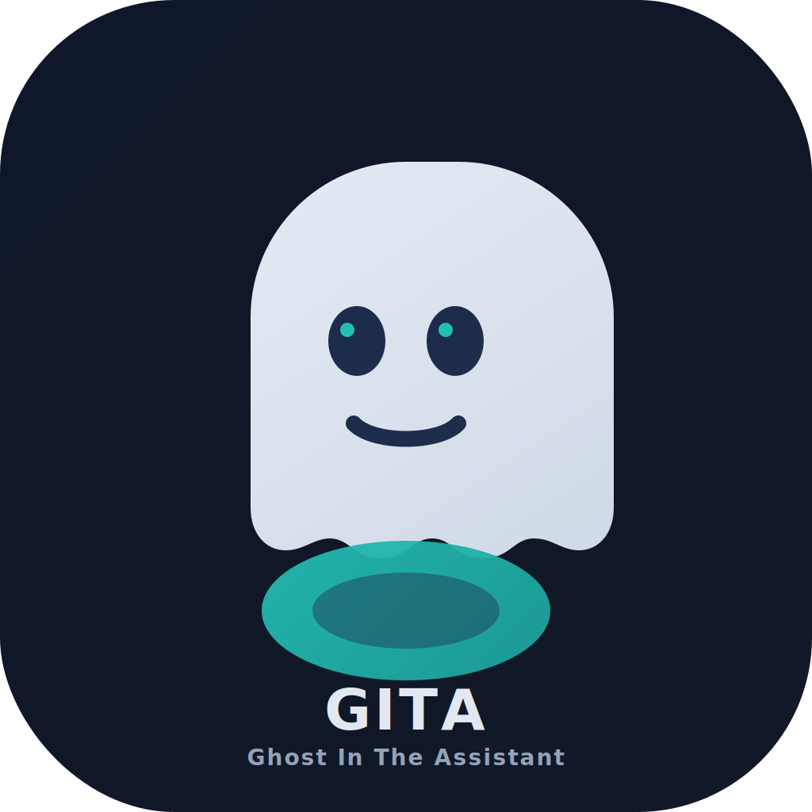

# GITA (Ghost In The Assistant)

<p align="center">
  
</p>

**GITA** is a tiny Docker-ready service that turns text into wake-word commands for voice assistants.

It works standalone, and is also deeply integrated with the **OpenClaw ecosystem**.

**TealClaw is optional, but highly awesome when paired.**

- TealClaw repo: https://github.com/Snail3D/tealclaw
- GITA repo: https://github.com/Snail3D/gita

## What it does

You send a command like:
- `assistant=siri, command="open messages"`

GITA will:
1. Generate a wake phrase clip (e.g. `Hey Siri`)
2. Wait a short delay (default 2500ms)
3. Generate/play the command clip (e.g. `open messages`)

This significantly improves wake-word hit rate vs speaking everything in one clip.

---

## Quick start

```bash
cd /Users/ericwoodard/Desktop/programs/gita
cp .env.example .env
# add your GROQ_API_KEY in .env
npm install
npm start
```

Service runs on `http://localhost:3000`.

---

## `.env` example

```env
GROQ_API_KEY=your_key_here
ENABLE_PLAYBACK=true
DEFAULT_VOICE=troy
DEFAULT_SPEED=0.9
WAKE_DELAY_MS=2500
PORT=3000
```

---

## API

### `POST /trigger`

Payload:

```json
{
  "assistant": "alexa",
  "command": "play the audio bible on Audible",
  "voice": "troy",
  "speed": 0.9,
  "wakeDelayMs": 2500,
  "wakePhrase": "Computer",
  "prePauseMs": 0,
  "preVolume": null
}
```

- `assistant`: `alexa | google | siri | custom`
- `wakePhrase`: required only when `assistant=custom`
- `prePauseMs`: delay **before** wake phrase playback (useful for timed follow-up commands)
- `preVolume`: optional host volume set before playback

### Example: Siri

```bash
curl -X POST http://localhost:3000/trigger \
  -H "Content-Type: application/json" \
  -d '{
    "assistant":"siri",
    "command":"open messages",
    "speed":0.9,
    "wakeDelayMs":2800
  }'
```

### Example: Alexa

```bash
curl -X POST http://localhost:3000/trigger \
  -H "Content-Type: application/json" \
  -d '{
    "assistant":"alexa",
    "command":"play the audio bible on Audible",
    "speed":0.9,
    "wakeDelayMs":2500
  }'
```

### Example: two-step Alexa sequence (play, then raise volume 5s later)

```bash
# 1) Play music using spoken "eighties" phrasing for clearer TTS
curl -X POST http://localhost:3000/trigger \
  -H "Content-Type: application/json" \
  -d '{
    "assistant":"alexa",
    "command":"play eighties music",
    "speed":0.9
  }'

# 2) Five seconds later, use custom wake phrase + follow-up command
curl -X POST http://localhost:3000/trigger \
  -H "Content-Type: application/json" \
  -d '{
    "assistant":"custom",
    "wakePhrase":"Hey Alexa",
    "command":"raise the volume",
    "prePauseMs":5000,
    "speed":0.9
  }'
```


### Voice Control mode (Mac accessibility)

For macOS Voice Control flows, direct command playback (no wake phrase) can be more reliable than routing through `/trigger`.

Use a tiny local Node runner that speaks each command with tuned timing:

```js
import { generateTTS } from './tts.js';
import { playAudio, sleep } from './playback.js';

const speed = 1.18;
const steps = [
  { text: 'open Notes', pauseMs: 1800 },
  { text: 'click New Note', pauseMs: 1600 },
  { text: 'type hello from voice control', pauseMs: 0 }
];

for (const step of steps) {
  const path = await generateTTS(step.text, undefined, speed);
  await playAudio(path);
  if (step.pauseMs) await sleep(step.pauseMs);
}
```

Tip: for Voice Control, explicit UI-target commands (e.g. `click Search`, `show numbers`, `click 14`) are often more reliable than keyboard shortcut phrases.

---


### `POST /flow/run`

Run a local step flow for desktop control timing.

```json
{
  "flow": [
    {"op":"speak","text":"open Notes","speed":1.18},
    {"op":"wait","ms":1800},
    {"op":"speak","text":"click New Note","speed":1.18}
  ]
}
```

Supported ops:
- `speak` → fields: `text`, optional `voice`, `speed`
- `wait` → fields: `ms`
- `trigger` → same payload as `/trigger`

### Duplex mode (standalone in GITA)

GITA now supports a local duplex loop for back-and-forth computer control.

#### Start

```bash
curl -X POST http://localhost:3000/duplex/start \
  -H "Content-Type: application/json" \
  -d '{
    "mode":"voice-control",
    "turnSeconds":5,
    "turnGapMs":700,
    "maxTurns":50
  }'
```

Modes:
- `voice-control` → replay recognized text as direct computer commands (no wake phrase)
- `assistant` → route recognized text through assistant wake/command flow (`assistant`, `wakePhrase`)

#### Stop / Status

```bash
curl -X POST http://localhost:3000/duplex/stop
curl http://localhost:3000/duplex/status
```

Notes:
- Duplex capture uses local microphone via `ffmpeg` (macOS `avfoundation`).
- Requires Groq key for STT + TTS.
- Say "stop duplex" in the mic to end session naturally.

## OpenClaw / TealClaw integration

GITA can run by itself (curl/API/automation scripts) and does **not** require TealClaw.

If you do use TealClaw, it's highly integrated:
- use the **`/gita`** command
- trigger from cron/schedules
- route remote requests through your OpenClaw setup

Typical TealClaw flow:
1. TealClaw command (`/gita ...`)
2. POST to GITA endpoint
3. GITA plays wake + command audio on host speakers

---

## Docker

```bash
docker-compose up --build -d
```

> Note: host speaker playback from Docker can be tricky on macOS Docker Desktop.
> For reliable local speaker playback, run with Node on host.

---

## Important limitations

This is an **audio-trigger hack** (not direct Siri/Alexa API control).

Reliability depends on:
- speaker volume
- mic distance/angle
- room noise
- device assistant settings

It cannot bypass platform restrictions with silent/private APIs.
